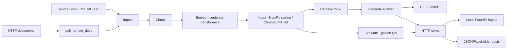

# RAG Document Pipeline

Production-oriented retrieval-augmented generation pipeline for an internal knowledge base. Documents under `data/source_docs/` are ingested, chunked, embedded locally, and indexed for question answering with offline extractive generation (optional OpenAI-compatible LLM).

## Architecture



| Stage | Module | I/O |
|-------|--------|-----|
| pull_remote_docs | `src/integrations/remote_docs.py` | HTTP URLs → `data/remote_docs/` |
| Ingest | `src/ingest/` | local + remote files → `documents.jsonl` |
| Chunk | `src/chunk/` | docs → `chunks.jsonl` |
| Embed | `src/embed/` | chunks → `embeddings.npy` |
| Index | `src/index/` | vectors → `data/index/` (NumPy vectors by default) |
| Retrieve | `src/retrieve/` | query → ranked hits |
| Generate | `src/generate/` | hits → grounded answer |
| Evaluate | `src/eval/` | golden set → `eval/results.json` |
| push_results | `src/integrations/api_sink.py` | ask/eval JSON → HTTP sinks |

### Sources

| Source | Type | Notes |
|--------|------|-------|
| `data/source_docs/` | File | Default offline corpus |
| `sources.http_documents` in `config/pipeline.yaml` | HTTP GET | Primary API source — public URLs (GitHub raw Markdown, JSONPlaceholder post JSON). Fetched into `data/remote_docs/` and merged at ingest |

### Sinks

| Sink | Type | Notes |
|------|------|-------|
| Local landing API | HTTP POST | `src/sinks/http_sink_server.py` — `POST /ingest` → `data/landing/`; `SINK_API_URL` default `http://127.0.0.1:8089/ingest` |
| [JSONPlaceholder](https://jsonplaceholder.typicode.com/posts) | HTTP POST | Alternate external sink (`EXTERNAL_SINK_URL`) |
| File fallback | Local JSON | If local sink is unreachable, results are written under `data/landing/` |

Configuration lives in [`config/pipeline.yaml`](config/pipeline.yaml). Longer design notes: [`docs/architecture.md`](docs/architecture.md).

## Requirements

- Python 3.10+
- ~500 MB disk for the embedding model on first run (cached by Hugging Face)

## Setup

```bash
git clone https://github.com/user-JB007/rag-document-pipeline.git
cd rag-document-pipeline
python -m venv .venv
source .venv/bin/activate
pip install -r requirements.txt
```

Default index backend is NumPy cosine (`index.backend: numpy`). Optional: `pip install chromadb` or `faiss-cpu` and set `index.backend` accordingly.

Optional LLM generation: copy `.env.example` to `.env` and set `OPENAI_BASE_URL`, `OPENAI_API_KEY`, `OPENAI_MODEL`. Leave unset to use the default offline extractive answerer. Set `generate.mode: openai_compatible` in `config/pipeline.yaml` to call the API.

## Commands

**Build the index** (ingest → chunk → embed → index):

```bash
python -m src.pipeline run --stage index
```

**Ask a question:**

```bash
python -m src.pipeline ask --question "How often must system owners run access reviews for production applications?"
```

**Run evaluation:**

```bash
python -m src.pipeline run --stage eval
```

**Full rebuild + eval:**

```bash
python -m src.pipeline run --stage all
```

**API source + sink:**

```bash
# Fetch remote HTTP documents into data/remote_docs/
python -m src.pipeline run --stage pull_remote_docs

# Push ask/eval results to local sink + JSONPlaceholder
python -m src.pipeline run --stage push_results

# Ask and POST the answer payload
python -m src.pipeline ask --question "How often must system owners run access reviews for production applications?" --sink api

# Local sink receiver
uvicorn src.sinks.http_sink_server:app --host 127.0.0.1 --port 8089
```

Offline: skip `pull_remote_docs` / use existing `data/source_docs/` only. If a prior remote file exists for a URL, network failures reuse it.

**HTTP API:**

```bash
uvicorn src.api.app:app --host 0.0.0.0 --port 8000
# GET  /health
# POST /ask  {"question": "...", "top_k": 4}
```

**Airflow:** import `dags/rag_pipeline_dag.py` (weekly rebuild + eval). Airflow itself is not a required install dependency.

## Knowledge corpus

| File | Topic |
|------|-------|
| `data/source_docs/access_control_policy.md` | Account provisioning, reviews, revocation |
| `data/source_docs/incident_response_runbook.md` | SEV triage, containment, communications |
| `data/source_docs/product_faq_billing.txt` | Plans, invoices, refunds, failed payments |
| `data/source_docs/data_retention_policy.md` | Retention periods, deletion, legal holds |
| `data/source_docs/oncall_handoff_guide.md` | Shift boundaries, ack SLAs, escalation |

Add new Markdown, TXT, or PDF files under `data/source_docs/` and rebuild the index.

## Module map

```
src/
  pipeline.py          CLI entrypoint
  config.py            YAML loader
  models.py            Document / Chunk / RetrievalHit
  ingest/loader.py
  chunk/splitter.py
  embed/encoder.py
  index/store.py
  retrieve/searcher.py
  generate/answerer.py
  eval/metrics.py
  integrations/        remote HTTP docs + result sink client
  sinks/http_sink_server.py
  api/app.py           FastAPI /ask + /health
dags/rag_pipeline_dag.py
config/pipeline.yaml
eval/questions.json
```

## Evaluation metrics

Defined in `src/eval/metrics.py` against `eval/questions.json`:

- **hit@k** — expected document appears in top-k retrieval
- **keyword_recall** — fraction of expected keywords present in answer/context
- **context_relevance** — query-token overlap with retrieved passages
- **faithfulness_lite** — fraction of answer content words supported by context

Results are written to `eval/results.json`.

## License

MIT
